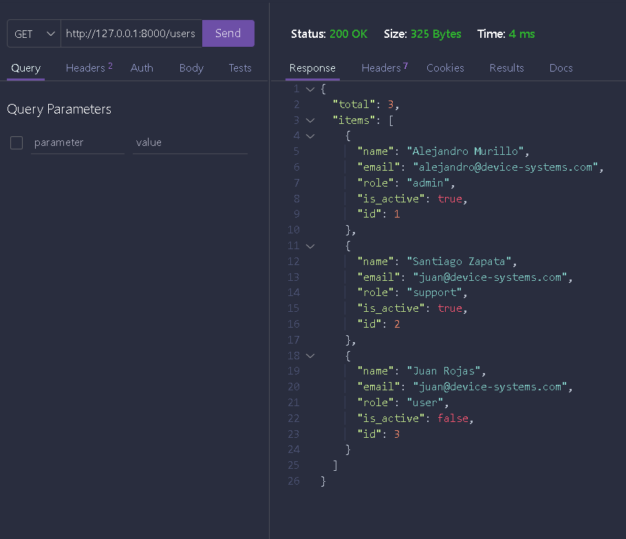
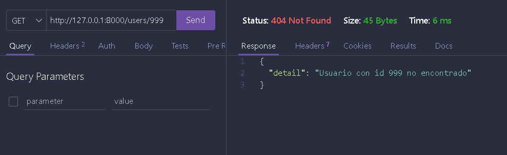
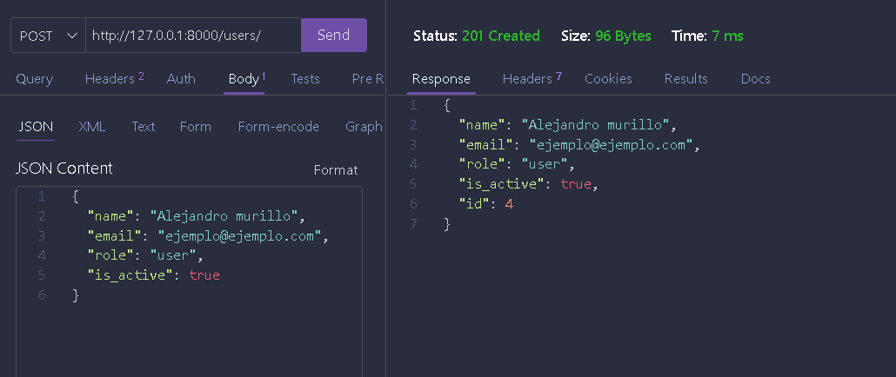
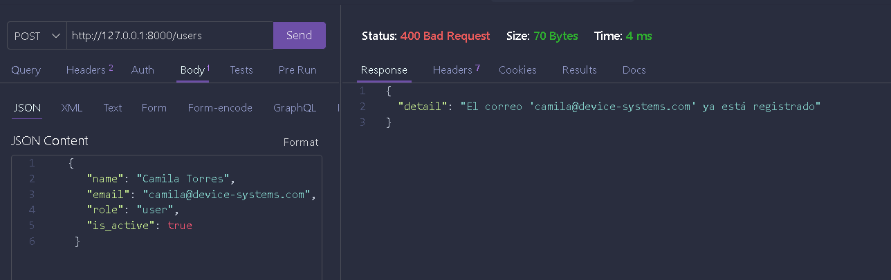
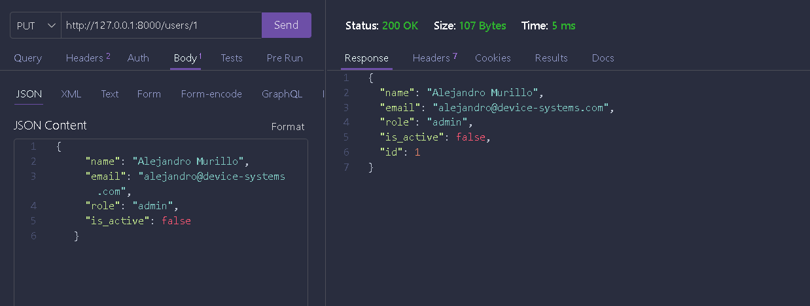
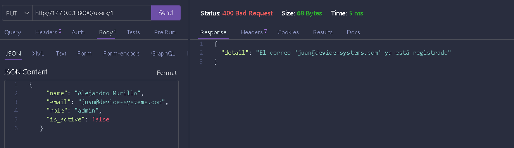
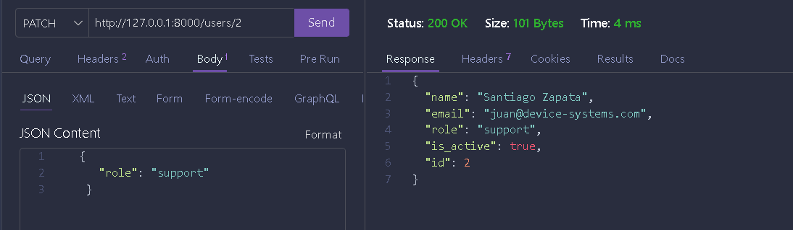
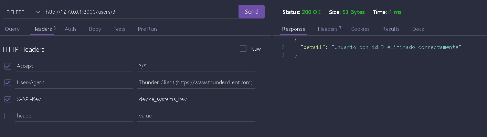
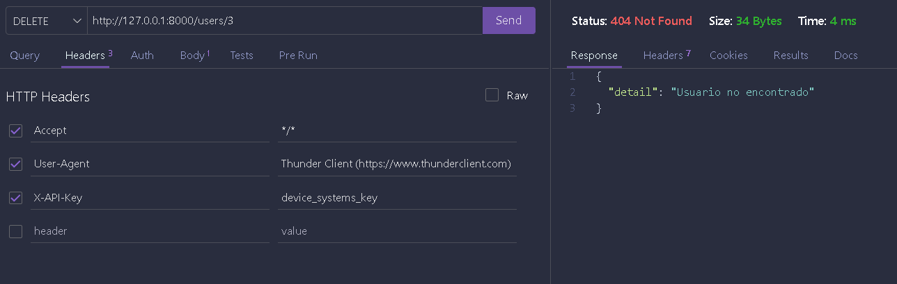

# device_systems

API REST para la gestión de usuarios desarrollada con **FastAPI**, evolucionada desde una implementación con datos en memoria hacia una arquitectura con **SQLAlchemy** y una base de datos relacional **SQLite**.

La aplicación mantiene las funcionalidades construidas en la actividad anterior y agrega persistencia real, modelo ORM, `Engine`, `Session`, dependencias de sesión, constraints de base de datos, transacciones y manejo controlado de errores.

## 1. Objetivo de la actividad

Evolucionar la API REST de usuarios de `device_systems` para dejar de trabajar con datos almacenados en memoria y utilizar una base de datos relacional mediante SQLAlchemy.

La implementación final permite:

- Crear usuarios en la base de datos.
- Consultar usuarios.
- Buscar usuarios por ID.
- Filtrar usuarios por rol.
- Filtrar usuarios por estado activo/inactivo.
- Actualizar usuarios mediante `PUT`.
- Actualizar parcialmente usuarios mediante `PATCH`.
- Eliminar usuarios mediante `DELETE`.
- Aplicar validaciones con Pydantic v2.
- Aplicar constraints en el modelo SQLAlchemy.
- Manejar errores de validación, inexistencia, duplicidad y base de datos.
- Documentar la API mediante Swagger/OpenAPI y ReDoc.

La guía de FastAPI utilizada como base define el proyecto `device_systems`, el recurso `users`, los campos `id`, `name`, `email`, `role` e `is_active`, las validaciones Pydantic, los endpoints GET y POST, los filtros por rol y estado, los Response Models, las cabeceras personalizadas y la documentación mediante Swagger UI. Esta versión conserva esas funcionalidades y las conecta con persistencia relacional. 

## 2. Tecnologías

- **Python 3.11+**
- **FastAPI**
- **Uvicorn**
- **Pydantic v2**
- **email-validator**
- **SQLAlchemy 2.x**
- **SQLite**
- **Swagger UI / OpenAPI**
- **ReDoc**

## 3. Arquitectura

La aplicación está organizada por responsabilidades:

```text
device_systems/
│
├── app/
│   ├── database/
│   │   ├── __init__.py
│   │   └── database.py
│   │
│   ├── models/
│   │   ├── __init__.py
│   │   └── user_model.py
│   │
│   ├── schemas/
│   │   ├── __init__.py
│   │   └── user_schema.py
│   │
│   ├── services/
│   │   ├── __init__.py
│   │   └── user_service.py
│   │
│   ├── dependencies/
│   │   ├── __init__.py
│   │   └── user_dependencies.py
│   │
│   ├── routes/
│   │   ├── __init__.py
│   │   └── user_routes.py
│   │
│   └── main.py
│
├── pruebas/
│   └── evidencias anteriores de la API
│
├── .env.example
├── .gitignore
├── requirements.txt
├── README.md
└── device_systems.db
```

### Responsabilidad de cada capa

| Carpeta/archivo | Responsabilidad |
|---|---|
| `app/database/database.py` | Configuración de la URL, `Engine`, `SessionLocal`, clase `Base` y dependencia `get_db`. |
| `app/models/user_model.py` | Modelo ORM `User`, columnas y constraints de la tabla `users`. |
| `app/schemas/user_schema.py` | Validación y serialización mediante Pydantic. |
| `app/services/user_service.py` | Lógica CRUD, consultas SQLAlchemy, transacciones y manejo de errores de persistencia. |
| `app/dependencies/user_dependencies.py` | Dependencias reutilizables: sesión, usuario por ID, filtros, configuración y API Key. |
| `app/routes/user_routes.py` | Endpoints HTTP, parámetros, dependencias, códigos de estado y Response Models. |
| `app/main.py` | Configuración de FastAPI, creación de tablas, middleware, handlers y router principal. |
| `device_systems.db` | Base de datos SQLite utilizada por la aplicación (vacía hasta que se crean usuarios). |


## 4. Flujo de datos

```text
Cliente HTTP
    │
    ▼
FastAPI / Routes
    │
    ├── Pydantic valida la entrada
    │
    ▼
Dependencies
    │
    ├── get_db()
    ├── get_user_or_404()
    ├── role_filter()
    ├── active_filter()
    └── verify_api_key()
    │
    ▼
Services
    │
    ▼
SQLAlchemy ORM
    │
    ▼
Session
    │
    ▼
Engine
    │
    ▼
SQLite
    │
    ▼
users
```

## 5. Persistencia con SQLAlchemy

La implementación utiliza SQLAlchemy como ORM. La aplicación ya no utiliza un diccionario Python como almacenamiento de usuarios.

### Engine

El `Engine` administra la comunicación entre SQLAlchemy y el motor de base de datos.

La configuración utiliza SQLite por defecto:

```text
sqlite:///./device_systems.db
```

También puede configurarse mediante la variable de entorno `DATABASE_URL`.

### Session

`SessionLocal` crea sesiones de SQLAlchemy para ejecutar consultas y operaciones de persistencia.

La dependencia `get_db()` abre una sesión por solicitud y la cierra al finalizar.

### Base

Los modelos ORM heredan de la clase declarativa `Base`, que permite a SQLAlchemy registrar las tablas y generar su metadata.

### ORM

El modelo `User` representa la tabla `users`. Las operaciones CRUD utilizan consultas SQLAlchemy mediante `select()`, `add()`, `commit()`, `refresh()` y `delete()`.

## 6. Modelo de datos y constraints

La tabla `users` contiene:

| Campo | Tipo | Restricción / función |
|---|---|---|
| `id` | INTEGER | Primary Key, índice |
| `name` | VARCHAR(80) | NOT NULL, mínimo 3 caracteres, máximo 80 |
| `email` | VARCHAR(254) | NOT NULL, UNIQUE, índice, máximo 254 |
| `role` | VARCHAR(20) | NOT NULL, valores permitidos `admin`, `support`, `user` |
| `is_active` | BOOLEAN | NOT NULL, índice |
| `internal_notes` | VARCHAR(255) | NOT NULL, campo interno no expuesto |

El modelo SQLAlchemy aplica los siguientes constraints:

- `PRIMARY KEY` para `id`.
- `NOT NULL` para los campos obligatorios.
- `UNIQUE` para `email`.
- `CHECK` para el mínimo y máximo del nombre.
- `CHECK` para la longitud máxima del correo.
- `CHECK` para restringir `role` a `admin`, `support` o `user`.

La validación se realiza en dos niveles: Pydantic valida los datos recibidos por la API y SQLAlchemy/SQLite protege la integridad de los datos almacenados.

## 7. Validaciones Pydantic

### Nombre

- Obligatorio.
- Mínimo 3 caracteres.
- Máximo 80 caracteres.

### Email

- Obligatorio.
- Debe tener formato válido mediante `EmailStr`.
- Se normaliza a minúsculas antes de persistir.
- No puede duplicarse.

### Rol

Los valores permitidos son:

```text
admin
support
user
```

### Estado

`is_active` debe ser booleano.

### PUT

El modelo `UserUpdate` exige los cuatro campos principales porque `PUT` representa un reemplazo completo.

### PATCH

El modelo `UserPatch` permite enviar únicamente los campos que se desean modificar.

## 8. Creación de tablas

Al iniciar la aplicación, SQLAlchemy ejecuta `Base.metadata.create_all()` y crea la tabla `users` en `device_systems.db` si todavía no existe.

La API **no carga usuarios de ejemplo**: la tabla queda vacía y lista para que cualquier persona que la use cree sus propios usuarios mediante `POST /users`.

## 9. Instalación

Desde la carpeta del proyecto:

### Windows PowerShell

```powershell
python -m venv venv
.\venv\Scripts\Activate.ps1
pip install -r requirements.txt
```

### Linux / macOS

```bash
python3 -m venv venv
source venv/bin/activate
pip install -r requirements.txt
```

## 10. Configuración opcional

Se incluye `.env.example` como referencia para las variables utilizadas por la aplicación:

```env
DATABASE_URL=sqlite:///./device_systems.db
API_KEY=device_systems_key
API_VERSION=3.0.0
```

El archivo `.env` se carga automáticamente al iniciar la aplicación. El archivo `.env` real no debe publicarse ni incluir credenciales sensibles en una entrega o repositorio.

Si no se define `DATABASE_URL`, la aplicación utiliza automáticamente `sqlite:///./device_systems.db`.

Si no se define `API_KEY`, la aplicación utiliza `device_systems_key` como clave académica de demostración.

## 11. Ejecución
=======
API REST desarrollada con **FastAPI** para la gestión del recurso **users**. Este proyecto es la evolución de la actividad anterior (Clase 7 – Fundamentos de FastAPI) hacia una API con **CRUD completo**, manejo profesional de errores, códigos de estado correctos, documentación Swagger/OpenAPI mejorada y **Dependency Injection** con `Depends()` (Clase 8 – FastAPI Intermedio).

## 1. Descripción de la aplicación

`device_systems` administra usuarios de un sistema, permitiendo:

- Listar usuarios, con filtros opcionales por **rol** y **estado activo**.
- Consultar, **crear**, **actualizar (total y parcialmente)** y **eliminar** usuarios.
- Validación automática de datos con **Pydantic v2**.
- Respuestas estandarizadas que ocultan campos internos (`internal_notes`).
- Manejo de errores explícito: usuario no encontrado, correo duplicado, rol no permitido, actualización sin datos, eliminación de usuario inexistente.
- Reutilización de lógica común mediante **Dependency Injection**.

## 2. Tecnologías utilizadas

- **FastAPI** — framework web para construir la API.
- **Uvicorn** — servidor ASGI que ejecuta la aplicación.
- **Pydantic v2** — validación y serialización de datos.
- **email-validator** — validación de formato de correo electrónico.

## 3. Estructura del proyecto

```
device_systems/
│── app/
│   │── main.py                     # Punto de entrada, middleware, metadatos OpenAPI
│   │── routes/
│   │   └── user_routes.py          # Definición de endpoints (sin lógica de negocio)
│   │── schemas/
│   │   └── user_schema.py          # Modelos Pydantic de entrada y salida
│   │── services/
│   │   └── user_service.py         # Lógica de negocio (crear, listar, actualizar, borrar)
│   │── dependencies/
│   │   └── user_dependencies.py    # Funciones reutilizables con Depends()
│   │── data/
│   │   └── users_db.py             # Simulación de base de datos en memoria
│── requirements.txt
│── README.md
```

**¿Por qué esta separación?**
- `routes` solo traduce HTTP ↔ Python: recibe la petición y llama a `services`.
- `services` contiene las reglas de negocio (por ejemplo, qué significa "correo duplicado"), independientes de si vienen de una petición HTTP o de otro lugar.
- `dependencies` centraliza validaciones repetidas (buscar usuario por ID, verificar una API key) para no reescribirlas en cada endpoint.
- `data` aísla el almacenamiento en memoria para que ninguna otra capa dependa directamente de cómo se guardan los datos.

## 4. Instalación de dependencias

```bash
cd device_systems
python -m venv venv
venv\Scripts\Activate.ps1        # Windows
# source venv/bin/activate       # Linux / macOS
pip install -r requirements.txt
```

## 5. Ejecución del servidor
>>>>>>> origin/main

```bash
uvicorn app.main:app --reload
```

<<<<<<< HEAD
Direcciones principales:

```text
API       http://127.0.0.1:8000
Swagger   http://127.0.0.1:8000/docs
ReDoc     http://127.0.0.1:8000/redoc
OpenAPI   http://127.0.0.1:8000/openapi.json
```

## 12. Tabla completa de endpoints

| Método | Endpoint | Función | Éxito | Errores principales |
|---|---|---|---:|---|
| GET | `/` | Estado de la API | 200 | — |
| GET | `/users` | Listar usuarios | 200 | — |
| GET | `/users?role=admin` | Filtrar por rol | 200 | 422 si el rol no es válido |
| GET | `/users?is_active=true` | Filtrar por estado | 200 | 422 si el valor no es booleano |
| GET | `/users/{user_id}` | Buscar por ID | 200 | 404 |
| POST | `/users` | Crear usuario | 201 | 400, 422 |
| PUT | `/users/{user_id}` | Actualización completa | 200 | 400, 404, 422 |
| PATCH | `/users/{user_id}` | Actualización parcial | 200 | 400, 404, 422 |
| DELETE | `/users/{user_id}` | Eliminar usuario | 200 | 401, 404, 500 |

## 13. Ejemplos de peticiones

### GET /users

```http
GET http://127.0.0.1:8000/users
```

Respuesta (la lista empieza vacía hasta que se crean usuarios; ejemplo tras crear uno):

```json
{
  "total": 1,
  "items": [
    {
      "id": 1,
      "name": "Nombre Apellido",
      "email": "usuario@ejemplo.com",
      "role": "admin",
      "is_active": true
    }
  ]
}
```

El campo `internal_notes` existe en la base de datos, pero no se expone en `UserPublic`.

### GET /users/{user_id}

```http
GET http://127.0.0.1:8000/users/1
```

### GET por rol

```http
GET http://127.0.0.1:8000/users?role=admin
```

### GET por estado

```http
GET http://127.0.0.1:8000/users?is_active=true
```

### POST /users

```http
POST http://127.0.0.1:8000/users
Content-Type: application/json
```

```json
{
  "name": "Nombre Apellido",
  "email": "usuario@ejemplo.com",
  "role": "user",
  "is_active": true
}
```

Respuesta esperada: `201 Created`.

### PUT /users/{user_id}

```http
PUT http://127.0.0.1:8000/users/1
Content-Type: application/json
```

```json
{
  "name": "Nombre Apellido Actualizado",
  "email": "nuevo.correo@ejemplo.com",
  "role": "admin",
  "is_active": true
}
```

### PATCH /users/{user_id}

```http
PATCH http://127.0.0.1:8000/users/2
Content-Type: application/json
```

```json
=======
- API: `http://127.0.0.1:8000`
- Swagger UI: `http://127.0.0.1:8000/docs`
- ReDoc: `http://127.0.0.1:8000/redoc`

> El proyecto incluye 3 usuarios de ejemplo precargados (`id` 1, 2 y 3).

## 6. Tabla de endpoints

| Método | Endpoint            | Descripción                          | Código éxito | Código error                     |
|--------|----------------------|----------------------------------------|---------------|------------------------------------|
| GET    | `/`                   | Estado de la API                      | 200           | —                                   |
| GET    | `/users`              | Lista usuarios (filtros `role`, `is_active`) | 200    | —                                   |
| GET    | `/users/{user_id}`    | Consulta un usuario por ID             | 200           | 404 si no existe                   |
| POST   | `/users`              | Crea un usuario                        | 201           | 400 correo duplicado · 422 datos inválidos |
| PUT    | `/users/{user_id}`    | Reemplaza TODOS los campos del usuario | 200           | 404 no existe · 400 correo duplicado · 422 datos inválidos |
| PATCH  | `/users/{user_id}`    | Modifica solo los campos enviados      | 200           | 404 no existe · 400 sin campos o correo duplicado |
| DELETE | `/users/{user_id}`    | Elimina un usuario (requiere header `X-API-Key`) | 200 | 404 no existe · 401 API Key inválida |

## 7. Ejemplos de peticiones y respuestas

### PUT /users/{user_id} — reemplazo completo

**Request:**
```
PUT http://127.0.0.1:8000/users/1
Content-Type: application/json

{
  "name": "Nombre Apellid",
  "email": "ejemplo@device-systems.com",
  "role": "admin",
  "is_active": false
}
```

**Response (200):**
```json
{
  "id": 1,
  "name": "Nombre Apellido",
  "email": "ejemplo@device-systems.com",
  "role": "admin",
  "is_active": false
}
```

Si falta cualquiera de los 4 campos, responde **422** (Pydantic los exige todos en `UserUpdate`).

### PATCH /users/{user_id} — actualización parcial

**Request:**
```
PATCH http://127.0.0.1:8000/users/2
Content-Type: application/json


{
  "role": "support"
}
```

<<<<<<< HEAD
Si se envía `{}` se responde `400 Bad Request`.

### DELETE /users/{user_id}

```http
=======
**Response (200):** el usuario completo, con solo el `role` cambiado; el resto de sus campos quedan intactos.

**Si se envía un body vacío `{}`:**
```json
{
  "detail": "Debe enviar al menos un campo para actualizar"
}
```
→ **400 Bad Request**

### DELETE /users/{user_id}

**Request:**
```

DELETE http://127.0.0.1:8000/users/3
X-API-Key: device_systems_key
```


Respuesta:

=======
**Response (200):**

```json
{
  "detail": "Usuario con id 3 eliminado correctamente"
}
```

<<<<<<< HEAD
## 14. Manejo de errores

### 400 Bad Request

Se utiliza para situaciones como:

- Correo ya registrado.
- Violación controlada de una restricción de base de datos.
- `PATCH` sin campos para actualizar.

### 401 Unauthorized

Se devuelve cuando `DELETE` no recibe una API Key válida.

### 404 Not Found

Se devuelve cuando el usuario solicitado no existe.

La búsqueda por ID se centraliza en `get_user_or_404`.

### 422 Unprocessable Entity

FastAPI y Pydantic la generan cuando los datos recibidos no cumplen el esquema definido, por ejemplo un correo inválido, un nombre demasiado corto o un rol no permitido.

### 500 Internal Server Error

Los errores no controlados y los errores generales de SQLAlchemy reciben una respuesta genérica para no exponer detalles internos de la implementación.

En las operaciones de escritura se utiliza `rollback()` cuando una transacción falla para devolver la sesión a un estado consistente.

## 15. Response Models

La respuesta pública utiliza `UserPublic` y no expone `internal_notes`.

El listado utiliza `UserListResponse`:

```json
{
  "total": 3,
  "items": []
}
```

Esto mantiene la estandarización de respuestas desarrollada en la actividad anterior.

## 16. Cabeceras HTTP

Las respuestas incluyen:

```text
X-App-Name: device_systems
X-API-Version: 3.0
```

La operación `DELETE` utiliza además:

```text
X-API-Key: device_systems_key
```

La API Key es únicamente una protección académica de demostración y no representa un sistema completo de autenticación.

## 17. Swagger/OpenAPI

FastAPI genera automáticamente la documentación de la API.

### Swagger UI

```text
http://127.0.0.1:8000/docs
```

Desde Swagger se pueden probar:

- GET `/users`
- GET `/users/{user_id}`
- POST `/users`
- PUT `/users/{user_id}`
- PATCH `/users/{user_id}`
- DELETE `/users/{user_id}`

También se pueden observar los esquemas Pydantic y las respuestas documentadas.

### ReDoc

```text
http://127.0.0.1:8000/redoc
```

## 18. Cómo probar la API

La API puede probarse desde Swagger UI, ReDoc, Postman, Thunder Client o `curl`. Antes de empezar, levanta el servidor:

```bash
uvicorn app.main:app --reload
```

y abre `http://127.0.0.1:8000/docs`.

### Opción A — Swagger UI (recomendado)

1. Abre `/docs`.
2. Despliega el endpoint que quieras probar y haz clic en **Try it out**.
3. Completa los parámetros o el body de ejemplo.
4. Haz clic en **Execute** y revisa el código de estado y el JSON de respuesta.
5. Repite con cada endpoint siguiendo la checklist de la sección siguiente.

### Opción B — curl / Postman / Thunder Client

La base de datos empieza vacía, así que primero hay que crear usuarios antes de poder consultarlos, filtrarlos, actualizarlos o borrarlos. Los IDs los asigna la base de datos automáticamente (empiezan en 1 y suben), así que usa el `id` que te devuelva cada `POST` en las siguientes peticiones.

```bash
# 1. Confirmar que arranca vacía
curl http://127.0.0.1:8000/users
# -> {"total": 0, "items": []}

# 2. Crear un usuario (anota el "id" de la respuesta, aquí se asume que es 1)
curl -X POST http://127.0.0.1:8000/users \
  -H "Content-Type: application/json" \
  -d '{"name": "Nombre Apellido", "email": "usuario@ejemplo.com", "role": "admin", "is_active": true}'

# 3. Crear un segundo usuario con otro rol/estado para poder filtrar
curl -X POST http://127.0.0.1:8000/users \
  -H "Content-Type: application/json" \
  -d '{"name": "Otro Usuario", "email": "otro@ejemplo.com", "role": "support", "is_active": false}'

# 4. Listar y consultar
curl http://127.0.0.1:8000/users
curl http://127.0.0.1:8000/users/1

# 5. Filtrar por rol y por estado
curl "http://127.0.0.1:8000/users?role=admin"
curl "http://127.0.0.1:8000/users?is_active=true"

# 6. Actualización completa (reemplaza {id} por el id real)
curl -X PUT http://127.0.0.1:8000/users/1 \
  -H "Content-Type: application/json" \
  -d '{"name": "Nombre Apellido", "email": "usuario@ejemplo.com", "role": "admin", "is_active": true}'

# 7. Actualización parcial
curl -X PATCH http://127.0.0.1:8000/users/1 \
  -H "Content-Type: application/json" \
  -d '{"role": "support"}'

# 8. Eliminar (requiere API Key)
curl -X DELETE http://127.0.0.1:8000/users/1 \
  -H "X-API-Key: device_systems_key"
```

### Checklist de pruebas mínimas (según la guía de la actividad)

Como la base de datos arranca vacía, sigue el orden de la tabla: primero crea usuarios (pruebas 1-2) y usa esos mismos IDs para el resto de las pruebas.

| # | Prueba | Cómo verificarla | Resultado esperado |
|---:|---|---|---|
| 1 | Crear un usuario válido | `POST /users` con datos correctos | `201 Created` y el usuario en la respuesta |
| 2 | Crear un usuario con email repetido | `POST /users` reutilizando un correo existente | `400 Bad Request` |
| 3 | Listar usuarios | `GET /users` | `200 OK` con `total` e `items` |
| 4 | Consultar usuario por ID | `GET /users/1` | `200 OK` con los datos del usuario |
| 5 | Consultar usuario inexistente | `GET /users/999` | `404 Not Found` |
| 6 | Filtrar por rol | `GET /users?role=admin` (repetir con `support` y `user`) | `200 OK` solo con usuarios de ese rol |
| 7 | Filtrar usuarios activos | `GET /users?is_active=true` (y con `false`) | `200 OK` solo con usuarios de ese estado |
| 8 | Actualizar usuario completo | `PUT /users/{id}` con los 4 campos | `200 OK` con los datos actualizados |
| 9 | Actualizar parcialmente | `PATCH /users/{id}` con un solo campo | `200 OK`, solo cambia el campo enviado |
| 10 | Eliminar usuario | `DELETE /users/{id}` con `X-API-Key` correcta | `200 OK` con mensaje de confirmación |
| 11 | Validar que el usuario eliminado ya no exista | `GET /users/{id}` sobre el ID eliminado | `404 Not Found` |

### Otras validaciones a probar

- Nombre con menos de 3 caracteres → `422 Unprocessable Entity`.
- Correo con formato inválido → `422 Unprocessable Entity`.
- Rol no permitido (distinto de `admin`, `support`, `user`) → `422 Unprocessable Entity`.
- Tipo incorrecto para `is_active` (por ejemplo un string) → `422 Unprocessable Entity`.
- `PUT` con algún campo faltante → `422 Unprocessable Entity`.
- `PATCH` con body vacío `{}` → `400 Bad Request`.
- `DELETE` sin `X-API-Key` o con una clave incorrecta → `401 Unauthorized`.

### Prueba de persistencia real

Esta prueba confirma que los datos sobreviven a un reinicio del servidor (a diferencia de la versión anterior en memoria):

1. Crear un usuario válido.
2. Consultarlo mediante `GET /users/{id}`.
3. Verificar que aparezca en `device_systems.db` (por ejemplo abriendo el archivo con DB Browser for SQLite).
4. Detener el servidor (`Ctrl+C`).
5. Iniciar nuevamente la API (`uvicorn app.main:app --reload`).
6. Consultar el mismo usuario.
7. Confirmar que el registro sigue disponible sin necesidad de volver a crearlo.
8. Intentar registrar otro usuario con el mismo correo.
9. Confirmar que la restricción `UNIQUE` de `email` evita el duplicado (`400 Bad Request`).

## 19. Evidencias anteriores

La carpeta `pruebas/` conserva las evidencias generadas durante las actividades anteriores de FastAPI.

Entre ellas se encuentran capturas de:

- Swagger UI.
- ReDoc.
- GET `/users`.
- GET `/users/{id}` exitoso y con 404.
- POST `/users` exitoso.
- Validaciones de POST.
- PUT exitoso y errores.
- PATCH exitoso y errores.
- DELETE exitoso y errores.
- Validación de API Key.

Para la nueva actividad se deben agregar capturas que demuestren específicamente:

- Estructura final del proyecto.
- `Engine` y configuración de SQLAlchemy.
- `SessionLocal` y `get_db`.
- Modelo ORM `User`.
- Constraints del modelo.
- Tabla `users` en SQLite.
- POST guardando datos en la base de datos.
- Persistencia después de reiniciar la API.
- Error por correo duplicado.
- CRUD completo funcionando con SQLAlchemy.

## 20. Checklist de cumplimiento

| Requisito | Estado |
|---|---|
| Proyecto `device_systems` | Cumplido |
| FastAPI | Cumplido |
| Recurso `users` | Cumplido |
| GET `/users` | Cumplido |
| GET `/users/{user_id}` | Cumplido |
| Filtro por rol | Cumplido |
| Filtro por estado | Cumplido |
| POST `/users` | Cumplido |
| PUT `/users/{user_id}` | Cumplido |
| PATCH `/users/{user_id}` | Cumplido |
| DELETE `/users/{user_id}` | Cumplido |
| Pydantic v2 | Cumplido |
| Response Models | Cumplido |
| Cabeceras HTTP personalizadas | Cumplido |
| SQLAlchemy | Cumplido |
| Engine | Cumplido |
| Session | Cumplido |
| Dependencia `get_db` | Cumplido |
| Modelo ORM | Cumplido |
| Base de datos relacional | Cumplido |
| Persistencia real | Cumplido |
| Primary Key | Cumplido |
| NOT NULL | Cumplido |
| UNIQUE | Cumplido |
| CHECK constraints | Cumplido |
| Manejo de `IntegrityError` | Cumplido |
| `rollback()` en transacciones fallidas | Cumplido |
| Manejo de 404 | Cumplido |
| Manejo de 401 | Cumplido |
| Manejo de 422 | Cumplido |
| Manejo de 500 | Cumplido |
| Swagger/OpenAPI | Cumplido |
| ReDoc | Cumplido |
| README actualizado | Cumplido |

## 21. Diferencia entre la versión anterior y la versión actual

### Antes

```text
FastAPI
   ↓
Routes
   ↓
Services
   ↓
users_db.py
   ↓
diccionario Python
```

Los usuarios existían únicamente mientras permanecía disponible el proceso de Python.

### Ahora

```text
FastAPI
   ↓
Routes
   ↓
Dependencies
   ↓
Services
   ↓
SQLAlchemy Session
   ↓
Engine
   ↓
SQLite
   ↓
users
```

Los usuarios quedan almacenados de forma persistente en `device_systems.db`.

## 22. Nota sobre migraciones

La actividad se implementa con `Base.metadata.create_all()` porque el alcance actual requiere la creación y persistencia de la estructura relacional mediante SQLAlchemy. No se incorpora Alembic porque no forma parte de los requisitos indicados para esta actividad.

## 23. Git y entrega

No se debe publicar el archivo `.env` real ni credenciales sensibles.

El archivo `.env.example` puede utilizarse como plantilla.

La base de datos local está incluida para facilitar la demostración del proyecto, pero también puede eliminarse antes de una ejecución limpia; al iniciar la aplicación se crean las tablas y se cargan los datos iniciales si la tabla `users` está vacía.
=======
**Sin la cabecera `X-API-Key` o con una clave incorrecta:**
```json
{
  "detail": "API Key inválida o no proporcionada"
}
```
→ **401 Unauthorized**

> La clave de prueba usada en este proyecto académico es `device_systems_key`. En Thunder Client debe agregarse en la pestaña **Headers** de la petición DELETE: `X-API-Key: device_systems_key`.

## 8. Códigos de estado usados

| Código | Significado                              | Cuándo ocurre                                             |
|--------|--------------------------------------------|-------------------------------------------------------------|
| 200    | OK                                          | GET, PUT, PATCH y DELETE exitosos                            |
| 201    | Created                                     | POST exitoso                                                 |
| 400    | Bad Request                                 | Correo duplicado (POST/PUT/PATCH) · PATCH sin campos          |
| 401    | Unauthorized                                | DELETE sin `X-API-Key` válida                                 |
| 404    | Not Found                                   | Operación sobre un `user_id` que no existe                    |
| 422    | Unprocessable Entity                        | Datos que no cumplen las validaciones de Pydantic              |
| 500    | Internal Server Error                       | Error no controlado (manejado por el exception handler global) |

## 9. Explicación del uso de Depends()

Se implementaron 5 dependencias reutilizables en `app/dependencies/user_dependencies.py`:

- **`get_user_or_404(user_id)`** — busca el usuario y lanza 404 si no existe. Se reutiliza en `GET /users/{id}`, `PUT`, `PATCH` y `DELETE`: los cuatro necesitan exactamente esta misma comprobación antes de hacer su trabajo específico.
- **`role_filter` / `active_filter`** — encapsulan los query parameters de `GET /users`, dejando la firma del endpoint más limpia.
- **`get_api_settings()`** — entrega configuración general de la API (nombre, versión); se usa en el endpoint raíz `/` para no repetir esos valores como texto suelto.
- **`verify_api_key`** — simula autenticación básica leyendo la cabecera `X-API-Key`; se aplica únicamente en `DELETE /users/{id}` para demostrar que un endpoint puede protegerse de forma independiente al resto.

Al declarar un parámetro como `Depends(funcion)`, FastAPI ejecuta esa función automáticamente antes del cuerpo del endpoint, y si la dependencia lanza una excepción (por ejemplo `HTTPException(404)`), el endpoint nunca llega a ejecutarse.

## 10. Explicación del manejo de errores implementado

- **Usuario no encontrado (404):** centralizado en la dependencia `get_user_or_404`, usada en 4 endpoints distintos.
- **Correo electrónico duplicado (400):** validado en `user_service.email_in_use()`, que excluye al propio usuario cuando se actualiza (para no auto-rechazarse).
- **Rol no permitido (422):** automático, gracias a que `role` está tipado como el `Enum` `UserRole` en los esquemas Pydantic.
- **Actualización sin datos (400):** en `PATCH`, si `payload.model_dump(exclude_unset=True)` devuelve un diccionario vacío, se lanza el error antes de tocar la base de datos.
- **Eliminación de usuario inexistente (404):** cubierta por la misma dependencia `get_user_or_404`, reutilizada también en `DELETE`.
- **Errores no controlados (500):** capturados por un `@app.exception_handler(Exception)` global en `main.py`, para evitar que un fallo inesperado tumbe el servidor sin dar una respuesta clara.

## 11. Evidencias de pruebas (capturas)

### 11.1 Swagger UI


### 11.2 ReDoc


### 11.3 Evidencia GET /users y GET /users/{id}




### 11.4 Evidencia POST /users




### 11.5 Evidencia PUT /users/{id}





### 11.6 Evidencia PATCH /users/{id}



### 11.7 Evidencia DELETE /users/{id}




## 12. Reflexión final sobre la evolución del proyecto

Pasar de una API con solo GET y POST a una con CRUD completo obligó a organizar el código en capas: la lógica de negocio (`services`) se separó de las rutas para que cada endpoint quedara simple y legible, y las validaciones repetidas (como comprobar que un usuario exista) se centralizaron en dependencias reutilizables con `Depends()`. Esto redujo la duplicación de código entre `GET /users/{id}`, `PUT`, `PATCH` y `DELETE`, que ahora comparten la misma comprobación de existencia sin repetirla cuatro veces. Además, distinguir entre `UserUpdate` (todos los campos obligatorios) y `UserPatch` (todos opcionales) reforzó la diferencia real entre una actualización total y una parcial, en vez de simular esa diferencia con lógica manual. En conjunto, el proyecto ahora refleja mejor cómo se estructura una API REST profesional: capas separadas, errores explícitos y consistentes, y documentación que se genera junto con el código.


